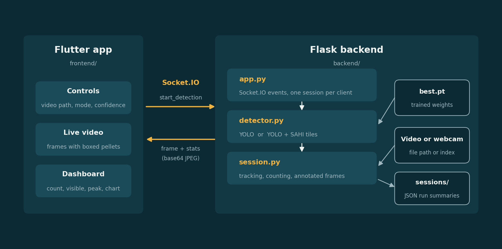

# Fish feeding tracker

A small app that counts feed pellets in fish feeding videos. You pick a video (or a webcam), and it shows the stream with every pellet boxed and numbered, plus a live count next to it.

The model is a YOLO detector trained on pellets. The interface is a Flutter app, and it talks to a Flask backend over Socket.IO, which does the detection and tracking and sends the frames back.

I started this in 2024 and reorganised it in 2026: the backend is split into modules, the app has a proper dashboard, and the settings are no longer hardcoded.

## How it works



There are two detection modes:

- **YOLO** runs the model on the full frame and uses the tracker built into Ultralytics. This is the fast one.
- **YOLO + SAHI** cuts each frame into overlapping tiles before detecting, which finds more of the small pellets but runs slower. Tracking here is done with ByteTrack.

What the dashboard shows:

- **Pellets counted:** distinct pellets seen. A track has to appear in at least `MIN_TRACK_FRAMES` frames before it counts, so a single-frame false detection doesn't add to the total.
- **Visible now / Peak visible:** how many pellets are in the current frame, and the most seen at once.
- **Highest track ID:** the largest ID the tracker has handed out. This is the number my first version called the pellet count. It goes up whenever a pellet loses its ID and gets a new one, so it overestimates.
- **Uneaten estimate:** pellets still visible divided by pellets counted. It's a rough guide, not a measurement of waste.

## Running it

You need Python 3.10 or newer and Flutter. I developed it on Windows with Flutter 3.19.

### Backend

```bash
cd backend
python -m venv .venv
pip install -r requirements.txt
```

On Windows, activate the environment with `.venv\Scripts\activate` before the `pip install` line. On Linux or macOS use `source .venv/bin/activate`.

Copy `.env.example` to `.env`, then put your trained weights at `backend/weights/best.pt`. The weights are not in the repo. Start the server:

```bash
python app.py
```

Opening `http://127.0.0.1:4002/health` should report `"weights_found": true`. If you have an NVIDIA GPU, set `DEVICE=cuda:0` in `.env`.

### App

```bash
cd frontend
flutter create . --project-name fish_feeding_tracker
flutter pub get
flutter run -d windows
```

`flutter create .` only has to run once, it generates the platform folders. If you don't have Visual Studio installed, `flutter run -d edge` runs it in the browser instead.

Type the path of a video file in the box at the top (or `0` for a webcam), choose a mode, and press Start tracking. The confidence slider and mode can't be changed while a run is going.

On an Android emulator, use the gear icon to change the backend address to `http://10.0.2.2:4002`. On a phone, use your computer's local IP.

## Settings

Everything is in `backend/.env`: confidence threshold, image size, SAHI slice size and overlap, JPEG quality, frame rate cap, and the minimum track length. `.env.example` has the defaults.

## Socket.IO events

From the app to the backend:

| Event | Payload |
|---|---|
| `start_detection` | `{source, mode, conf}` where mode is `yolo` or `sahi` |
| `stop_detection` | none |

From the backend to the app:

| Event | Payload |
|---|---|
| `frame` | `{frame, stats}` with the frame as a base64 JPEG |
| `status` | `{state, summary}` where state is `running` or `finished` |
| `error` | `{message}` |

There is also `GET /health`, and `GET /api/sessions` which returns the summaries of past runs.
